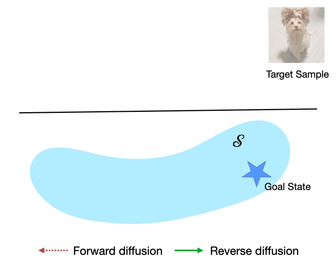

<div align="center">

# Learning to Reach Goals via Diffusion

</div>

This is the official repository of the paper [Learning to Reach Goals via Diffusion](https://arxiv.org/abs/2310.02505).

We propose Merlin, an offline goal-conditioned RL method inspired by diffusion. We construct trajectories that “diffuse away” from potential goals and train a policy to reverse them, analogous to the score function. 



## Setup

This repository uses Python 3.10 and Pytorch 2.3.1. To install the required packages, run the following command:

```bash
git clone git@github.com:vineetjain96/merlin.git
cd merlin

conda env create -f environment.yml
conda activate merlin
```
The above command will also install `mujoco-py` and the required dependencies. You will need to download the MuJoCo 2.1 binaries separately; instructions can be found [here](https://github.com/openai/mujoco-py).


After installing the dependencies:

```bash
export PYTHONPATH=${PWD}:$PYTHONPATH
```

## Offline Dataset

The offline dataset used in this project can be downloaded from [here](https://github.com/YangRui2015/AWGCSL/tree/master/offline_data). The datasets should be placed in the `offline_data` directory. 

The image datasets for supported environments will be created automatically when running the code.

## 2D Navigation Example

The code for running the 2D navigation example from the paper can be found in the `nav2d` directory. 

To train the Merlin policy, run the following command:

```bash
python nav2d/train_merlin.py
```

To train the [GCSL](https://github.com/dibyaghosh/gcsl) policy, run the following command:

```bash
python nav2d/train_gcsl.py
```

## Offline GCRL Experiments

The code for running the offline GCRL experiments from the paper can be found in the `src` directory. The task and variant (expert/random) can be specified using the `--task` and `--variant` flags.

For example, to run Merlin on the 'FetchReach' task using the expert dataset, run the following command:

```bash
python src/train_offline.py --task FetchReach --variant expert
```

To run the Merlin-P variant, which uses a learned reverse dynamics model, use the `--diffusion-rollout` flag:

```bash
python src/train_offline.py --task FetchReach --variant expert --diffusion-rollout
```

To run the Merlin-NP variant, which uses the trajectory stitching method, use the `--diffusion-nonparam` flag in addition to the `--diffusion-rollout` flag:

```bash
python src/train_offline.py --task FetchReach --variant expert --diffusion-rollout --diffusion-nonparam
```

To use image observations, which are only supported for 'PointReach', 'PointRooms', 'SawyerReach' and 'SawyerDoor' tasks, add the `--image-obs` flag:

```bash
python src/train_offline.py --task PointReach --variant expert --image-obs
```

## Citation

If this codebase is useful towards other research efforts please consider citing us.

```
@article{jain2023learning,
  title={Learning to Reach Goals via Diffusion},
  author={Jain, Vineet and Ravanbakhsh, Siamak},
  journal={arXiv preprint arXiv:2310.02505},
  year={2023}
}
```
